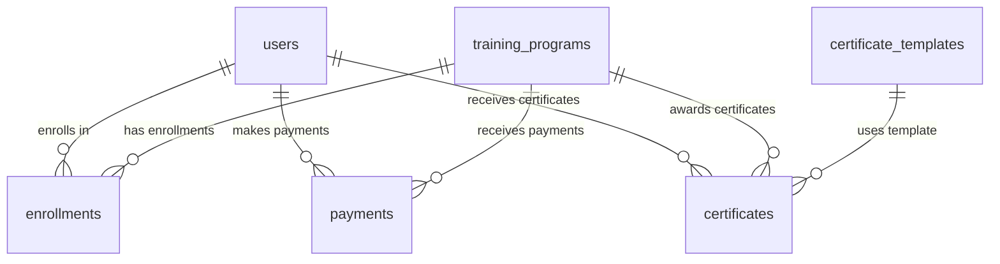
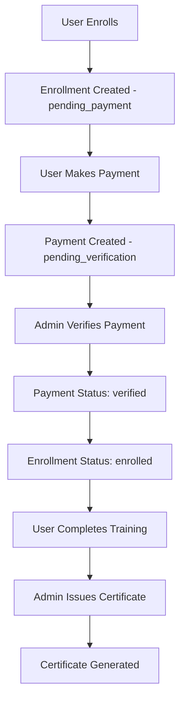

# Elevate Grow - Database Schema Plan

## Project Overview

This document outlines the complete database schema for the Elevate Grow training platform, a React/TypeScript application for managing online training programs, user enrollments, payments, and certificates.

## Schema Design Validation

Based on analysis of the frontend components, the following 7 tables are required and properly designed:

### 1. Users Table
**Purpose**: Stores people who enroll in training (not public visitors)

```sql
CREATE TABLE users (
    id UUID DEFAULT gen_random_uuid() PRIMARY KEY,
    full_name TEXT NOT NULL,
    email TEXT NOT NULL UNIQUE,
    phone TEXT,
    created_at TIMESTAMP WITH TIME ZONE DEFAULT NOW()
);
```

**Indexes**:
- `idx_users_email` on email (for login/lookup)
- `idx_users_created_at` on created_at (for analytics)

**Notes**:
- No password field needed if no user login initially
- Email + phone sufficient for tracking
- UUID primary key for security

### 2. Training Programs Table
**Purpose**: All training offerings

```sql
CREATE TABLE training_programs (
    id UUID DEFAULT gen_random_uuid() PRIMARY KEY,
    title TEXT NOT NULL,
    description TEXT,
    duration TEXT,
    price NUMERIC(10,2) NOT NULL CHECK (price >= 0),
    is_active BOOLEAN DEFAULT true,
    created_at TIMESTAMP WITH TIME ZONE DEFAULT NOW()
);
```

**Indexes**:
- `idx_training_programs_is_active` on is_active (for filtering)
- `idx_training_programs_price` on price (for sorting)

**Notes**:
- Price is fixed per training
- `is_active` controls visibility in frontend
- Matches requirements from `TrainingsManagement.tsx`

### 3. Enrollments Table
**Purpose**: Links users to training programs

```sql
CREATE TABLE enrollments (
    id UUID DEFAULT gen_random_uuid() PRIMARY KEY,
    user_id UUID NOT NULL REFERENCES users(id) ON DELETE CASCADE,
    training_id UUID NOT NULL REFERENCES training_programs(id) ON DELETE CASCADE,
    status TEXT NOT NULL CHECK (status IN ('pending_payment', 'enrolled', 'completed')) DEFAULT 'pending_payment',
    created_at TIMESTAMP WITH TIME ZONE DEFAULT NOW(),
    UNIQUE(user_id, training_id)
);
```

**Status Values**:
- `pending_payment` - User enrolled but payment not verified
- `enrolled` - Payment verified, user has access
- `completed` - User completed the training

**Indexes**:
- `idx_enrollments_user_id` on user_id
- `idx_enrollments_training_id` on training_id
- `idx_enrollments_status` on status

### 4. Payments Table
**Purpose**: Tracks all payments (UPI or future gateway)

```sql
CREATE TABLE payments (
    id UUID DEFAULT gen_random_uuid() PRIMARY KEY,
    user_id UUID NOT NULL REFERENCES users(id) ON DELETE CASCADE,
    training_id UUID NOT NULL REFERENCES training_programs(id) ON DELETE CASCADE,
    amount NUMERIC(10,2) NOT NULL CHECK (amount >= 0),
    payment_method TEXT NOT NULL DEFAULT 'UPI',
    transaction_reference TEXT NOT NULL,
    status TEXT NOT NULL CHECK (status IN ('pending_verification', 'verified', 'failed', 'refunded')) DEFAULT 'pending_verification',
    created_at TIMESTAMP WITH TIME ZONE DEFAULT NOW()
);
```

**Status Values**:
- `pending_verification` - Payment submitted, awaiting admin verification
- `verified` - Payment confirmed by admin
- `failed` - Payment rejected or failed
- `refunded` - Payment refunded

**Indexes**:
- `idx_payments_status` on status (for admin dashboard)
- `idx_payments_transaction_reference` on transaction_reference (for lookup)

### 5. Certificates Table
**Purpose**: Generated certificates

```sql
CREATE TABLE certificates (
    id UUID DEFAULT gen_random_uuid() PRIMARY KEY,
    user_id UUID NOT NULL REFERENCES users(id) ON DELETE CASCADE,
    training_id UUID NOT NULL REFERENCES training_programs(id) ON DELETE CASCADE,
    certificate_id TEXT NOT NULL UNIQUE,
    issue_date DATE NOT NULL DEFAULT CURRENT_DATE,
    file_url TEXT,
    created_at TIMESTAMP WITH TIME ZONE DEFAULT NOW(),
    UNIQUE(user_id, training_id)
);
```

**Notes**:
- `certificate_id` is shown on certificate (e.g., "CERT-2024-001")
- `file_url` stores PDF path in Supabase Storage
- One certificate per user per training program

### 6. Certificate Templates Table
**Purpose**: Stores the single general certificate design

```sql
CREATE TABLE certificate_templates (
    id UUID DEFAULT gen_random_uuid() PRIMARY KEY,
    name TEXT NOT NULL,
    template_type TEXT NOT NULL CHECK (template_type IN ('html', 'image', 'pdf')) DEFAULT 'html',
    template_url TEXT NOT NULL,
    is_active BOOLEAN DEFAULT false,
    created_at TIMESTAMP WITH TIME ZONE DEFAULT NOW()
);
```

**Notes**:
- Only one active template at a time
- Template types: html, image, or pdf
- Centralized certificate design management

### 7. Admin Activity Logs Table
**Purpose**: Professional audit trail

```sql
CREATE TABLE admin_activity_logs (
    id UUID DEFAULT gen_random_uuid() PRIMARY KEY,
    action TEXT NOT NULL,
    reference_id UUID,
    metadata JSONB,
    created_at TIMESTAMP WITH TIME ZONE DEFAULT NOW()
);
```

**Example Actions**:
- `payment_verified`
- `certificate_generated`
- `training_created`
- `user_enrolled`

## Database Relationships

### Primary Relationships


### Business Logic Flow


## Row Level Security (RLS) Policies

### User Data Protection
- Users can only view/update their own profile
- Users can only view their own enrollments, payments, certificates

### Public Data
- Training programs (active only) are publicly readable
- Active certificate templates are publicly readable

### Admin Access
- Admin activity logs require admin role
- Payment verification requires admin role
- Certificate issuance requires admin role

## Performance Optimizations

### Critical Indexes
1. `users(email)` - Fast user lookup
2. `payments(status)` - Admin dashboard filtering
3. `enrollments(user_id, training_id)` - User enrollment lookup
4. `certificates(certificate_id)` - Certificate verification

### Query Optimization Views
```sql
-- Admin dashboard stats
CREATE VIEW admin_dashboard_stats AS
SELECT 
    (SELECT COUNT(*) FROM users) AS total_users,
    (SELECT COUNT(*) FROM enrollments WHERE status = 'enrolled') AS active_enrollments,
    (SELECT SUM(amount) FROM payments WHERE status = 'verified') AS total_revenue,
    (SELECT COUNT(*) FROM certificates) AS certificates_issued;

-- Training programs with enrollment counts
CREATE VIEW training_programs_with_stats AS
SELECT 
    tp.*,
    COALESCE(e.enrollment_count, 0) AS enrollment_count
FROM training_programs tp
LEFT JOIN (
    SELECT training_id, COUNT(*) AS enrollment_count
    FROM enrollments
    GROUP BY training_id
) e ON tp.id = e.training_id;
```

## Data Validation & Constraints

### Business Rules Enforced
1. **Unique Enrollments**: One enrollment per user per training program
2. **Unique Certificates**: One certificate per user per training program  
3. **Positive Amounts**: Payment amounts must be >= 0
4. **Single Active Template**: Only one certificate template can be active
5. **Valid Status Values**: Enforced via CHECK constraints

### Trigger Functions
```sql
-- Ensure only one active certificate template
CREATE OR REPLACE FUNCTION ensure_single_active_template()
RETURNS TRIGGER AS $$
BEGIN
    IF NEW.is_active = true THEN
        UPDATE certificate_templates 
        SET is_active = false 
        WHERE is_active = true AND id != NEW.id;
    END IF;
    RETURN NEW;
END;
$$ LANGUAGE plpgsql;
```

## Frontend Integration Points

### Admin Dashboard Requirements Met
- **Dashboard.tsx**: Payment verification counts, enrollment stats, revenue totals
- **TrainingsManagement.tsx**: `is_active` control, enrollment counts, pricing
- **PaymentsManagement.tsx**: Payment status filtering, transaction tracking
- **CertificatesManagement.tsx**: Certificate ID generation, file URL storage
- **UsersManagement.tsx**: User profiles, enrollment tracking

### API Endpoints Supported
- User enrollment management
- Payment verification workflow
- Certificate generation and download
- Training program CRUD operations
- Admin activity logging

## Implementation Steps

### Phase 1: Core Tables
1. Create `users` table
2. Create `training_programs` table
3. Create `enrollments` table
4. Set up foreign key relationships

### Phase 2: Payment System
1. Create `payments` table
2. Add payment workflow triggers
3. Implement payment verification logic

### Phase 3: Certification System
1. Create `certificate_templates` table
2. Create `certificates` table
3. Add certificate generation logic

### Phase 4: Audit & Security
1. Create `admin_activity_logs` table
2. Implement RLS policies
3. Add audit triggers

### Phase 5: Optimization
1. Add performance indexes
2. Create helper views
3. Add utility functions

## Sample Data Structure

### Training Program Example
```json
{
  "id": "uuid",
  "title": "React.js Masterclass",
  "description": "Build modern, scalable web applications...",
  "duration": "8 weeks",
  "price": 15000.00,
  "is_active": true
}
```

### Enrollment Workflow Example
```json
{
  "user": { "email": "user@example.com", "full_name": "John Doe" },
  "enrollment": { "status": "pending_payment" },
  "payment": { "status": "pending_verification", "amount": 15000.00 },
  "certificate": null
}
```

## Migration Strategy

### Development Environment
1. Execute schema migrations in Supabase SQL Editor
2. Insert sample data for testing
3. Generate TypeScript types
4. Test with frontend components

### Production Deployment
1. Apply migrations during maintenance window
2. Verify data integrity
3. Update application configuration
4. Monitor performance metrics

## Security Considerations

### Data Protection
- UUID primary keys prevent enumeration attacks
- RLS policies ensure data isolation
- Email uniqueness prevents duplicate accounts

### Admin Functions
- Payment verification requires admin authentication
- Certificate issuance logged in audit trail
- Sensitive operations require proper authorization

### Compliance Ready
- Audit trail for all admin actions
- User data modification tracking
- Payment transaction history

## TypeScript Integration

The schema will generate TypeScript types for:
- Database row types
- Insert/update types
- API response types
- Supabase client configuration

## Conclusion

This database schema provides a robust foundation for the Elevate Grow training platform, supporting:

✅ **Complete User Journey**: From enrollment to certificate issuance  
✅ **Payment Processing**: UPI integration with admin verification  
✅ **Certificate Management**: Template-based certificate generation  
✅ **Admin Operations**: Full management dashboard support  
✅ **Security & Compliance**: RLS policies and audit trails  
✅ **Performance**: Optimized indexes and query patterns  
✅ **Scalability**: UUID-based design and proper normalization  

The schema aligns perfectly with the existing React frontend and provides all necessary data structures for the admin dashboard functionality.